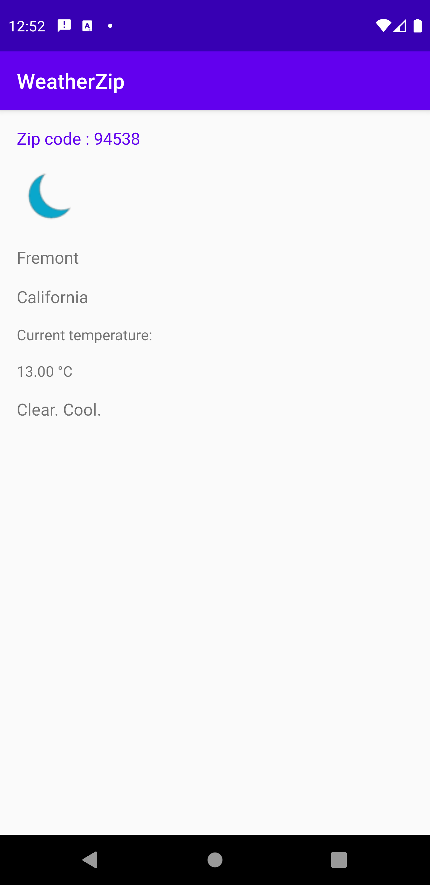

Weather App
=================

A weather app illustrating several Android development best practices with Android Jetpack.

The app will consist of one screen. On this screen, the app will display a zip code (chosen and hard-coded by you, which is 94538 Fremont, CA), as well as details of the current weather for that zip code. The details will include:
City, State, General Description, Current Temperature and Icon

Introduction
------------

Android Jetpack is a set of components, tools and guidance to make great Android apps. They bring
together the existing Support Library and Architecture Components and arrange them into four
categories:

Getting Started
---------------
This project uses the Gradle build system.

For more resources on learning Android development, visit the
[Developer Guides](https://developer.android.com/guide/) at
[developer.android.com](https://developer.android.com).

Screenshots
-----------

Libraries Used
--------------
* [Architecture][1] - A collection of libraries that help you design robust, testable, and
  maintainable apps. Start with classes for managing your UI component lifecycle and handling data
  persistence.
  * [Data Binding][2] - Declaratively bind observable data to UI elements.
  * [Lifecycles][3] - Create a UI that automatically responds to lifecycle events.
  * [LiveData][4] - Build data objects that notify views when the underlying database changes.
  * [Navigation][5] - Handle everything needed for in-app navigation.
  * [ViewModel][6] - Store UI-related data that isn't destroyed on app rotations. Easily schedule
     asynchronous tasks for optimal execution.
* Third party
  * [Glide][7] for image loading
  * [Kotlin Coroutines][8] for managing background threads with simplified code and reducing needs for callbacks

[1]: https://developer.android.com/jetpack/components
[2]: https://developer.android.com/topic/libraries/data-binding/
[3]: https://developer.android.com/topic/libraries/architecture/lifecycle
[4]: https://developer.android.com/topic/libraries/architecture/livedata
[5]: https://developer.android.com/topic/libraries/architecture/navigation/
[6]: https://developer.android.com/topic/libraries/architecture/viewmodel
[7]: https://bumptech.github.io/glide/
[8]: https://kotlinlang.org/docs/reference/coroutines-overview.html

Future work
-----------------
1. Add Room database for offline experience
2. Add Repository pattern
3. Add an edittext to query any place by zipcode

Android Studio IDE setup
------------------------
For development, the latest version of Android Studio is required. The latest version can be
downloaded from [here](https://developer.android.com/studio/).

